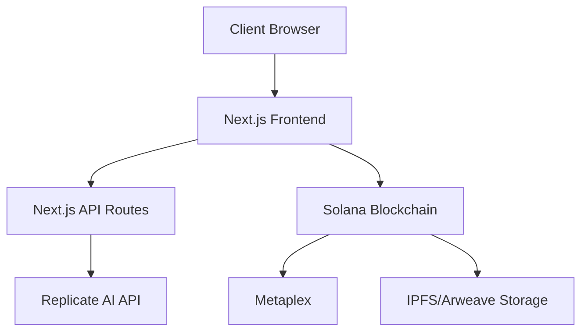
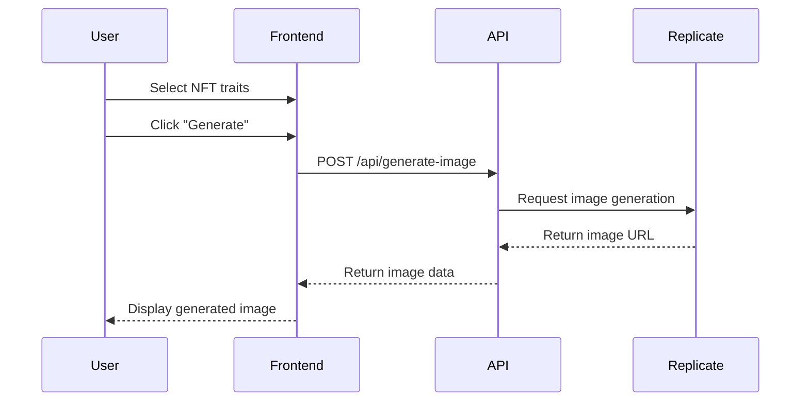
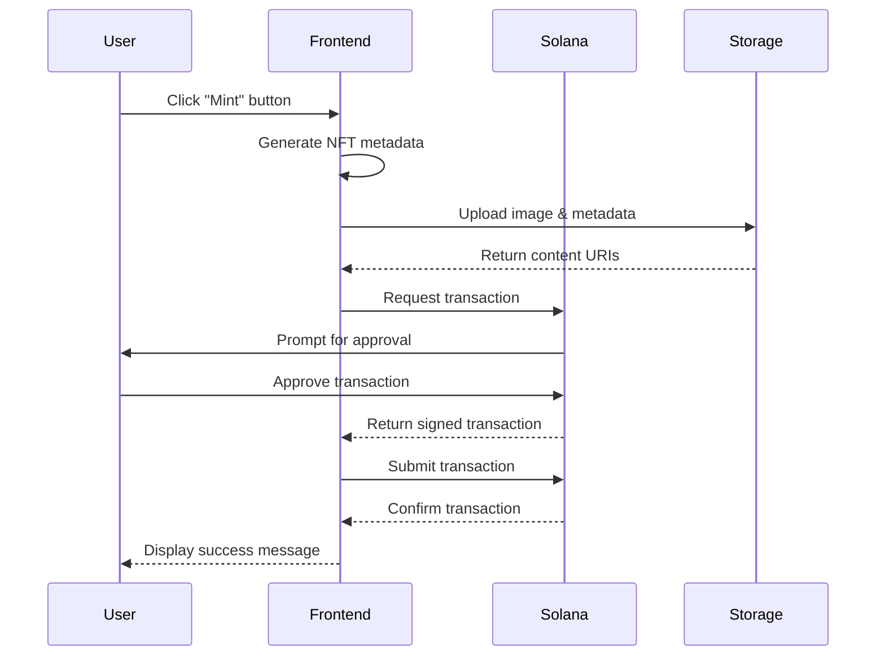

# Solana with deepseek-ai / janus-pro-1b NFT Minting Platform: Technical Documentation

## 1. System Overview

This project is a full-stack web application that enables users to mint unique NFTs on the Solana blockchain with artwork generated by AI. The system combines several cutting-edge technologies:

- **Next.js**: For the frontend and API routes
- **Solana Blockchain**: For NFT minting and wallet interactions
- **Replicate API**: For deepseek-ai/janus-pro-1b AI image generation
- **Tailwind CSS & shadcn/ui**: For responsive UI components

The platform allows users to:

1. Connect their Solana wallet
2. Customize NFT traits through an interactive UI
3. Generate preview images using AI
4. Mint unique NFTs to their wallet

## 2. Architecture

The application follows a modern web architecture with clear separation of concerns:



### Key Architectural Decisions

1. **Server-Side AI Generation**: AI image generation happens server-side via Next.js API routes to protect API keys and handle CORS issues.
2. **Client-Side Wallet Integration**: Wallet connection and transaction signing happen client-side for security.
3. **Responsive Design**: Mobile-first approach ensures usability across all devices.
4. **Type Safety**: TypeScript throughout the codebase ensures type safety and better developer experience.
5. **Component-Based UI**: Modular UI components for maintainability and reusability.

## 3. Key Components

### 3.1 Frontend Components

#### Core Pages

- **Home Page (`app/page.tsx`)**: Main entry point displaying the NFT minting interface.

#### UI Components

- **Metadata Component (`components/metadata.tsx`)**: Displays NFT collection information and the AI generation interface.
- **MintSection Component (`components/mint-section.tsx`)**: Handles the minting process and displays minting status.
- **LLMNFTPreview Component (`components/llm-nft-preview.tsx`)**: Interactive UI for customizing and generating AI artwork.
- **WalletMultiButton Component (`components/wallet-multi-button.tsx`)**: Handles wallet connection and displays wallet status.

#### Utility Components

- **UI Components (`components/ui/`)**: Reusable UI components like buttons, cards, sliders, etc.

### 3.2 Backend Components

#### API Routes

- **Generate Image API (`app/api/generate-image/route.ts`)**: Handles AI image generation requests.

#### Utilities

- **LLM Art Generator (`utils/llm-art-generator.ts`)**: Utilities for generating prompts and handling AI image generation.

#### Hooks

- **useSolanaConnection (`hooks/use-solana-connection.ts`)**: Custom hook for Solana connection management.
- **useMintNFT (`hooks/use-mint-nft.ts`)**: Custom hook for NFT minting logic.

### 3.3 External Integrations

- **Solana Wallet Adapter**: For wallet connection and transaction signing.
- **Replicate API**: For AI image generation.
- **Metaplex**: For NFT standard implementation on Solana.

## 4. Data Flow

### 4.1 AI Image Generation Flow



### 4.2 NFT Minting Flow



## 5. Technical Implementation Details

### 5.1 AI Image Generation

The AI image generation system uses a prompt engineering approach:

1. **Trait Selection**: Users select traits like Character Type, Suit Color, Background, and Accessory.
2. **Prompt Generation**: The system combines these traits into a detailed prompt:

```typescript
function generatePrompt(attributes: Record<string, string>, theme: string = "cosmic explorer"): string {
  const attributeDescriptions = Object.entries(attributes)
    .map(([key, value]) => `${key}: ${value}`)
    .join(", ");
  
  return `A detailed digital illustration of a ${theme} with ${attributeDescriptions}. 
  Highly detailed, vibrant colors, sci-fi aesthetic, space background, 
  professional digital art, trending on artstation, 4k resolution.`;
}
```

3. **API Integration**: The prompt is sent to Replicate's API via a Next.js API route:

```typescript
const output = await replicate.run(
  "stability-ai/sdxl:39ed52f2a78e934b3ba6e2a89f5b1c712de7dfea535525255b1aa35c5565e08b",
  {
    input: {
      prompt: body.prompt,
      negative_prompt: body.negativePrompt || "blurry, low quality, distorted, deformed",
      width: body.width || 1024,
      height: body.height || 1024,
      seed: body.seed || Math.floor(Math.random() * 1000000),
      num_outputs: 1,
      guidance_scale: 7.5,
      num_inference_steps: 25,
    }
  }
);
```

4. **Deterministic Generation**: For reproducibility, seeds are generated deterministically from prompts:

```typescript
function generateSeedFromString(str: string): number {
  let hash = 0;
  for (let i = 0; i < str.length; i++) {
    const char = str.charCodeAt(i);
    hash = ((hash << 5) - hash) + char;
    hash = hash & hash;
  }
  return Math.abs(hash);
}
```

### 5.2 Solana Integration

The Solana integration is handled through several components:

1. **Wallet Connection**: Using Solana Wallet Adapter:

```typescript
const wallets = useMemo(
  () => [
    new PhantomWalletAdapter(),
    new SolflareWalletAdapter(),
  ],
  []
);
```

2. **Connection Management**: Custom hook for Solana connection:

```typescript
export function useSolanaConnection() {
  const connection = useMemo(() => {
    return new Connection(SOLANA_RPC_ENDPOINT, 'confirmed');
  }, []);
  return connection;
}
```

3. **NFT Minting**: Using Metaplex for NFT standards compliance:

```typescript
const metaplex = Metaplex.make(connection).use({
  wallet: {
    publicKey,
    signTransaction,
    signAllTransactions: signTransaction,
  },
});
```

### 5.3 Responsive UI

The UI is built with a mobile-first approach using Tailwind CSS:

1. **Responsive Grid**: Adapts from single column on mobile to two columns on desktop:

```html
<div className="grid grid-cols-1 lg:grid-cols-2 gap-6 md:gap-12">
  <Metadata />
  <MintSection />
</div>
```

2. **Adaptive Components**: UI components adjust based on screen size:

```html
<header className="flex flex-col sm:flex-row justify-between items-center gap-4 mb-8 md:mb-12">
  <h1 className="text-2xl md:text-3xl font-bold text-center sm:text-left">AI-Generated Solana NFTs</h1>
  <WalletMultiButton />
</header>
```

3. **Consistent Spacing**: Responsive padding and margins:

```html
<CardContent className="p-4 md:p-6">
  <!-- Content -->
</CardContent>
```

## 6. Integration Points

### 6.1 Replicate API Integration

The system integrates with Replicate's API for AI image generation:

1. **Authentication**: Using API token stored in environment variables.
2. **Model Selection**: Using Stability AI's SDXL model for high-quality image generation.
3. **Error Handling**: Comprehensive error handling for API failures.

### 6.2 Solana Blockchain Integration

Integration with Solana happens through several components:

1. **Wallet Adapter**: For wallet connection and transaction signing.
2. **Metaplex**: For NFT standard implementation.
3. **RPC Connection**: For blockchain communication.

### 6.3 Storage Integration (Future)

For production, integration with decentralized storage is planned:

1. **IPFS/Arweave**: For permanent storage of NFT images and metadata.
2. **Content Addressing**: Using content hashes for immutable references.

## 7. Deployment Considerations

### 7.1 Environment Variables

The application requires several environment variables:

1. **REPLICATE_API_TOKEN**: For Replicate API access.
2. **NEXT_PUBLIC_SOLANA_RPC_ENDPOINT**: For Solana blockchain connection.
3. **NEXT_PUBLIC_SOLANA_NETWORK**: For specifying the Solana network (mainnet, devnet, testnet).

### 7.2 Build and Deployment

The application is designed to be deployed on Vercel:

1. **Next.js Optimization**: Leveraging Next.js's built-in optimizations.
2. **API Routes as Serverless Functions**: API routes deploy as serverless functions.
3. **Environment Variable Management**: Using Vercel's environment variable system.

### 7.3 Scaling Considerations

For production scaling:

1. **Rate Limiting**: Implementing rate limiting for API calls.
2. **Caching**: Caching generated images to reduce API calls.
3. **Error Handling**: Robust error handling and retry mechanisms.

## 8. Future Enhancements

### 8.1 Technical Enhancements

1. **Batch Generation**: Implementing batch generation of NFTs.
2. **Advanced Prompt Engineering**: More sophisticated prompt generation.
3. **Animation**: Adding animated NFT support.

### 8.2 Feature Enhancements

1. **Collection Management**: Tools for managing NFT collections.
2. **Marketplace Integration**: Integration with Solana marketplaces.
3. **Royalty Management**: Advanced royalty tracking and distribution.

### 8.3 Performance Enhancements

1. **Image Optimization**: Further optimization of image generation and delivery.
2. **Transaction Batching**: Batching transactions for efficiency.
3. **Progressive Loading**: Implementing progressive loading for better UX.

## 9. Code Organization

```plaintext
solana-nft-minter/
├── app/
│   ├── api/
│   │   └── generate-image/
│   │       └── route.ts         # AI image generation API
│   ├── globals.css              # Global styles
│   ├── layout.tsx               # Root layout
│   ├── page.tsx                 # Home page
│   └── providers.tsx            # Context providers
├── components/
│   ├── ui/                      # UI components
│   ├── llm-nft-preview.tsx      # AI preview component
│   ├── metadata.tsx             # NFT metadata component
│   ├── mint-section.tsx         # Minting interface
│   └── wallet-multi-button.tsx  # Wallet connection
├── hooks/
│   ├── use-mint-nft.ts          # NFT minting hook
│   └── use-solana-connection.ts # Solana connection hook
├── types/
│   └── nft.ts                   # Type definitions
├── utils/
│   └── llm-art-generator.ts     # AI generation utilities
├── next.config.mjs              # Next.js configuration
└── tailwind.config.ts           # Tailwind configuration
```

## 10. Engineering Principles

The project follows several key engineering principles:

1. **Separation of Concerns**: Clear separation between UI, business logic, and external integrations.
2. **DRY (Don't Repeat Yourself)**: Reusable components and utilities.
3. **Progressive Enhancement**: Core functionality works without JavaScript, enhanced with client-side features.
4. **Type Safety**: TypeScript throughout for better developer experience and fewer runtime errors.
5. **Responsive Design**: Mobile-first approach for all UI components.
6. **Security First**: API keys and sensitive operations handled server-side.
7. **User Experience**: Loading states, error handling, and intuitive UI for a smooth user experience.

This documentation provides a comprehensive overview of the Solana AI-Generated NFT Minting Platform's design and engineering. The modular architecture allows for easy maintenance and future enhancements while providing a seamless user experience for minting unique AI-generated NFTs on the Solana blockchain.
